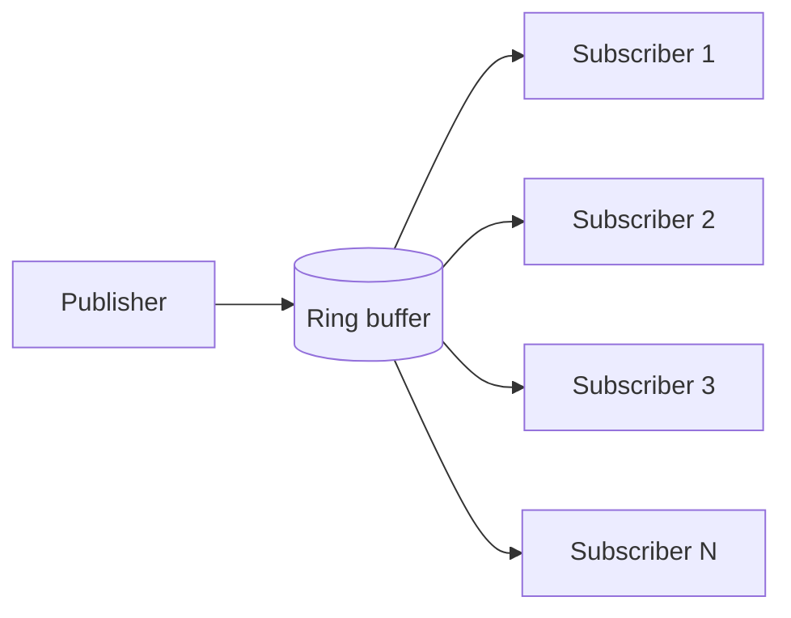
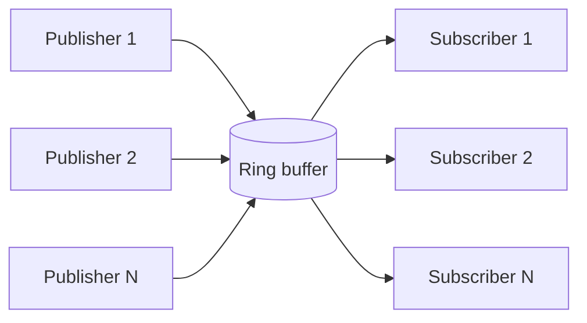
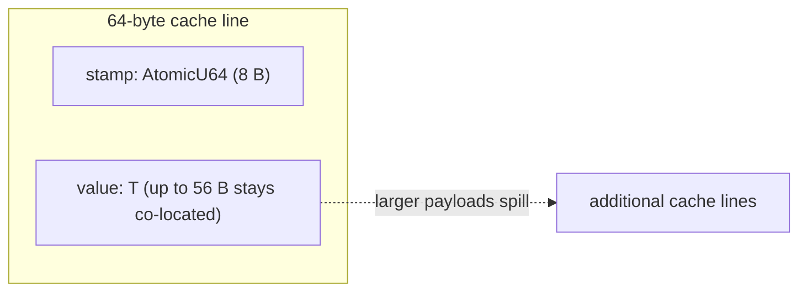

# Photon Ring

[](https://crates.io/crates/photon-ring)
[](https://docs.rs/photon-ring)
[](LICENSE-APACHE)
[](https://docs.rs/photon-ring)
[](https://github.com/userFRM/photon-ring/actions/workflows/ci.yml)

Ultra-low-latency `no_std`-compatible ring-buffer messaging for Rust: SPMC broadcast, optional MPMC publishing, named-topic buses, and pipeline topologies built on seqlock-stamped slots.

## Quick Start

```rust
use photon_ring::{channel, Photon};

// Low-level SPMC channel
let (mut publisher, subscribers) = channel::<u64>(1024);
let mut sub = subscribers.subscribe();

publisher.publish(42);
assert_eq!(sub.try_recv(), Ok(42));

// Named-topic bus
let bus = Photon::<u64>::new(1024);
let mut prices = bus.publisher("prices");
let mut prices_sub = bus.subscribe("prices");

prices.publish(101);
assert_eq!(prices_sub.try_recv(), Ok(101));
```

## Architecture

### SPMC



### MPMC



### Pipeline


### Slot Layout



For payloads up to 56 bytes, the stamp and value share the same cache line, so the consumer can validate availability and read the payload from one line.

## Public Types

| Public type | What it does |
|---|---|
| `Photon<T>` | Named-topic SPMC bus. Each topic lazily creates its own channel and has exactly one publisher. |
| `TypedBus` | Heterogeneous topic bus. Each topic may use a different `T: Copy + Send + 'static`; type mismatches panic. |
| `Publisher<T>` | Single-producer SPMC write handle with `publish`, `publish_batch`, `try_publish`, `published`, and `publish_with`. |
| `MpPublisher<T>` | Clone-able multi-producer write handle for `channel_mpmc`; multiple threads may publish concurrently. |
| `Subscribable<T>` | Clone-able subscriber factory returned by channel constructors and buses. |
| `Subscriber<T>` | Independent consumer with `try_recv`, `recv`, `recv_with`, `latest`, `recv_batch`, `drain`, and counters. |
| `SubscriberGroup<T, N>` | Grouped consumer that reads one slot once and advances one shared cursor for `N` logical subscribers. |
| `Drain<'a, T>` | Iterator produced by `Subscriber::drain()` that yields everything currently available. |
| `TryRecvError` | Non-blocking receive result: `Empty` or `Lagged { skipped }`. |
| `PublishError<T>` | Backpressure error for bounded SPMC channels: `Full(T)`. |
| `Shutdown` | Clone-able shutdown signal built on `Arc<AtomicBool>` for graceful loop termination. |
| `WaitStrategy` | Blocking receive policy: `BusySpin`, `YieldSpin`, `BackoffSpin`, or `Adaptive`. |
| `affinity::CoreId` | Re-exported core identifier used by the affinity helpers on supported OS targets. |
| `topology::Pipeline` | Finalized pipeline handle with `shutdown`, `join`, `stage_count`, `is_healthy`, and `panicked_stages`. |
| `topology::PipelineBuilder` | Entry point for thread-per-stage pipeline construction. |
| `topology::StageBuilder<T>` | Typed builder used to chain `then(...)` stages or branch with `fan_out(...)`. |
| `topology::FanOutBuilder<A, B>` | Builder for two-branch fan-out pipelines, with optional `then_a(...)` and `then_b(...)`. |

## Benchmarks

Reported medians for v1.0.0. The hot-path operations come from `benches/throughput.rs`; payload scaling is documented in `docs/payload-scaling.md`.

Machine A: Intel Core i7-10700KF  
Machine B: Apple M1 Pro

| Operation | Machine A | Machine B | Notes |
|---|---:|---:|---|
| Publish only | 2.9 ns | 2.0 ns | `Publisher::publish` |
| Roundtrip, 1 publisher / 1 subscriber | 2.6 ns | — | Same-thread `publish + try_recv` |
| Fanout, 10 independent subscribers | 15.9 ns | — | Same-thread read by 10 `Subscriber`s |
| `SubscriberGroup` aligned fanout, any `N` | 2.6 ns | — | Single seqlock read, effectively flat in the measured range |
| MPMC, 1 publisher / 1 subscriber | 12.2 ns | — | `MpPublisher` single-thread overhead |
| Cross-thread roundtrip | 95 ns | 103 ns | Publisher and subscriber on different OS threads |
| Empty poll | 0.85 ns | — | `Subscriber::try_recv()` on an empty channel |
| Batch 64 | 156 ns | — | `publish_batch` plus draining 64 messages |
| Struct roundtrip, 24 B payload | 4.8 ns | — | `Quote { f64, u64, u64 }` |
| Disruptor publish only | 25.8 ns | 12 ns | `disruptor` v4 comparison |
| Disruptor cross-thread roundtrip | 132 ns | 174 ns | `disruptor` v4 comparison |

## Comparison

| Capability | Photon Ring | `disruptor-rs` | `crossbeam-channel` | `bus` |
|---|---|---|---|---|
| Delivery model | Broadcast ring | Sequence-barrier ring | Point-to-point queue | Broadcast channel |
| Default topology | SPMC | SPMC / MPMC | MPMC | SPMC |
| Native MPMC publishing | Yes, via `MpPublisher` | Yes | Yes | No |
| First-class pipeline / fan-out builder | Yes, `topology::Pipeline` | Yes | No | No |
| Batch APIs | `publish_batch`, `recv_batch`, `drain` | Batch publishing / poller-style processing | Iterator-oriented draining, no broadcast batch API | No first-class batch API |
| Named-topic bus | `Photon<T>` and `TypedBus` | No | No | No |
| Backpressure | Optional on SPMC via `channel_bounded` | Yes | Yes | Yes |
| `no_std` core | Yes | No | No | No |
| Core affinity helpers | Yes | No | No | No |
| Hugepage / NUMA helpers | Yes, Linux `hugepages` feature | No | No | No |
| Payload bound | `T: Copy` | Pre-allocated event type | General queue payloads | `T: Clone` |
| Reported publish cost in this repo | 2.0-2.9 ns | 12-25.8 ns | — | — |
| Reported cross-thread roundtrip in this repo | 95-103 ns | 132-174 ns | — | — |

`crossbeam-channel` is a queue, not a broadcast primitive. If each message should be consumed by one receiver, use `crossbeam-channel`. If each message should be seen by every subscriber, Photon Ring or `bus` are the relevant comparisons.

## API

### SPMC Channel

Use `channel::<T>(capacity)` to create the fast path: one `Publisher<T>` and one `Subscribable<T>`.

- `capacity` must be a power of two and at least 2.
- `Subscribable::subscribe()` starts at the next message.
- `Subscribable::subscribe_from_oldest()` starts at the oldest message still in the ring.
- `Subscriber::try_recv()` returns `Ok(T)`, `Empty`, or `Lagged { skipped }`.
- `Subscriber::recv()` busy-spins for the lowest wakeup latency.
- `Subscriber::recv_with(strategy)` uses a configurable `WaitStrategy`.
- `Subscriber::latest()` skips directly to the newest published value.

### MPMC Channel

Use `channel_mpmc::<T>(capacity)` when you need more than one publishing thread.

- The subscriber side is unchanged: you still get `Subscribable<T>`, `Subscriber<T>`, and `SubscriberGroup<T, N>`.
- `MpPublisher<T>` is `Clone + Send + Sync`.
- `MpPublisher::publish(&self, value)` claims a sequence with atomics, writes the slot, then advances the cursor.
- `MpPublisher::published()` reports claimed sequence count across all clones.

MPMC costs more than SPMC because the write path adds atomic sequence claiming and ordered cursor advancement.

### `SubscriberGroup`

`Subscribable::subscribe_group::<N>()` creates a grouped consumer optimized for same-thread fan-out.

- One seqlock read serves all `N` logical subscribers.
- The group keeps one shared cursor, so `aligned_count()` is always `N`.
- `try_recv`, `recv`, `recv_with`, `pending`, `recv_batch`, and observability counters mirror `Subscriber`.
- The optimization is most useful when many consumers are polled together on the same thread.

### Backpressure

Use `channel_bounded::<T>(capacity, watermark)` for lossless SPMC operation.

- `Publisher::try_publish()` returns `Err(PublishError::Full(value))` instead of overwriting unread data.
- `Publisher::publish()` and `publish_batch()` spin until there is room.
- `watermark` reserves headroom before the slowest tracked subscriber.
- `Subscriber` and `SubscriberGroup` both participate in the slowest-cursor tracking.

The default `channel()` is intentionally lossy: freshness first, no publisher-side scan on the hot path.

### `Photon` Bus

`Photon<T>` is the named-topic layer over SPMC channels.

- `Photon::new(capacity)` sets the default ring size per topic.
- `publisher(topic)` lazily creates the topic and returns the only publisher for it.
- `subscribe(topic)` and `subscribable(topic)` create future-only subscribers for that topic.
- Topics are independent rings, so slow consumers on one topic do not affect another.

### `TypedBus`

`TypedBus` is the heterogeneous variant of `Photon`.

- Each topic gets its own concrete `T`.
- `publisher::<T>(topic)` and `subscribe::<T>(topic)` enforce type identity per topic.
- Accessing an existing topic with the wrong type panics with a clear diagnostic.

Use `Photon<T>` when every topic shares one payload type, and `TypedBus` when topics need different message types.

### Pipeline Topology

The `topology` module provides a builder-pattern pipeline on platforms with OS thread support.

```rust
use photon_ring::topology::Pipeline;

let (mut input, stages) = Pipeline::builder()
    .capacity(64)
    .input::<u64>();

let (mut output, pipeline) = stages
    .then(|x| x * 2)
    .then(|x| x + 1)
    .build();

input.publish(10);
assert_eq!(output.recv(), 21);

pipeline.shutdown();
pipeline.join();
```

- `Pipeline::builder()` starts construction.
- `StageBuilder::then(...)` adds a dedicated stage thread.
- `StageBuilder::fan_out(...)` splits work into two parallel branches.
- `FanOutBuilder::then_a(...)` and `then_b(...)` extend each branch independently.
- `Pipeline::is_healthy()` and `panicked_stages()` expose stage health.

### `WaitStrategy`

`WaitStrategy` controls blocking receive behavior without introducing OS primitives into the core path.

- `BusySpin`: minimum wakeup latency, maximum CPU burn.
- `YieldSpin`: spin-loop hint (`PAUSE` on x86, `WFE` path on aarch64 where implemented).
- `BackoffSpin`: exponential backoff for longer idle periods.
- `Adaptive`: default three-phase strategy with configurable spin and yield thresholds.

Use `Subscriber::recv_with(...)` or `SubscriberGroup::recv_with(...)` when `recv()` is too aggressive for your deployment.

### Core Affinity

On Linux, macOS, Windows, FreeBSD, NetBSD, and Android, the `affinity` module exposes:

- `available_cores()`
- `pin_to_core(core_id)`
- `pin_to_core_id(index)`
- `core_count()`

Pinning publisher and subscriber threads removes scheduler noise and is the simplest way to stabilize cross-thread latency.

### Hugepages and NUMA

On Linux with the `hugepages` feature enabled, Photon Ring exposes memory-control helpers:

- `Publisher::mlock()` to lock ring pages into RAM.
- `unsafe Publisher::prefault()` to touch each page before the hot path starts.
- `mem::mmap_huge_pages(size)` for huge-page-backed allocation.
- `mem::set_numa_preferred(node)` and `mem::reset_numa_policy()` for NUMA-aware ring placement.

`prefault()` is `unsafe` because it must be called before any publish or subscribe activity.

### Observability

Photon Ring keeps lightweight counters on the consumer side.

- `Subscriber::pending()` and `SubscriberGroup::pending()` report currently readable messages, capped at ring capacity.
- `total_received()`, `total_lagged()`, and `receive_ratio()` are available on both `Subscriber` and `SubscriberGroup`.
- `Publisher::published()` and `Publisher::sequence()` expose publisher progress.
- `Pipeline::stage_count()`, `is_healthy()`, and `panicked_stages()` help monitor stage-based topologies.

These are plain counters and atomics, not an external telemetry dependency.

### `recv_batch` and `drain`

Receive-side batching is built into the public API.

- `Subscriber::recv_batch(&mut [T]) -> usize`
- `SubscriberGroup::recv_batch(&mut [T]) -> usize`
- `Subscriber::drain() -> Drain<'_, T>`

Both batch methods transparently retry after lag recovery. `drain()` yields all messages currently available and stops when the ring is empty.

### `Shutdown`

`Shutdown` is the crate's minimal coordination primitive for graceful termination of consumer loops.

- `Shutdown::new()` creates an unset flag.
- `trigger()` sets the flag for every clone.
- `is_shutdown()` reads it with acquire semantics.

Use it when you want manual thread orchestration without committing to the `topology` module.

### `publish_with`

Both write handles support in-place construction:

- `Publisher::publish_with(...)`
- `MpPublisher::publish_with(...)`

The closure receives `&mut MaybeUninit<T>` for the target slot, which lets the compiler elide the write-side copy in favorable cases.

## Design Constraints

| Constraint | Why it exists |
|---|---|
| `T: Copy` | The protocol relies on value copies and retrying torn reads without running destructors. |
| Prefer plain numerics or `#[repr(C)]` numeric structs | `Copy` alone is not enough for types with validity invariants such as references, `bool`, or `NonZero*`. |
| Capacity must be a power of two | Slot indexing is `seq & mask`, not `% capacity`. |
| Capacity must be at least 2 | The ring implementation assumes a real wrap-around buffer. |
| SPMC is the primary fast path | `Publisher::publish(&mut self, ...)` keeps the single-producer path free of write-side synchronization. |
| Default channels are lossy | The publisher never blocks and readers detect overruns via `Lagged`. |
| Lossless mode is SPMC-only | Backpressure currently relies on a single producer scanning subscriber trackers. |
| 64-bit atomics are required | The cursor and stamp protocol uses `AtomicU64`, which excludes 32-bit ARM microcontrollers. |
| Slots are 64-byte aligned | Stamp and payload should share a cache line whenever the payload fits. |
| `topology` requires OS threads | Pipeline stages are implemented as dedicated `std::thread`s and are not available on wasm32 or bare-metal targets. |
| Hugepage controls are Linux-only | `mlock`, huge pages, and NUMA policy changes use Linux-specific syscalls. |

## Platform Support

| Platform | Core ring | `affinity` | `topology` | Hugepages / NUMA | Notes |
|---|---|---|---|---|---|
| x86_64 Linux | Yes | Yes | Yes | Yes | Full feature set |
| x86_64 macOS | Yes | Yes | Yes | No | Core + thread helpers |
| x86_64 Windows | Yes | Yes | Yes | No | Core + thread helpers |
| aarch64 Linux | Yes | Yes | Yes | Yes | Includes Linux memory controls |
| aarch64 macOS (Apple Silicon) | Yes | Yes | Yes | No | M1/M2/M3/M4-class systems |
| FreeBSD / NetBSD | Yes | Yes | Yes | No | No Linux memory-control module |
| Android | Yes | Yes | Yes | No | OS-thread targets only |
| `wasm32-unknown-unknown` | Yes | No | No | No | CI checks the core crate only |
| 32-bit ARM / Cortex-M | No | No | No | No | `AtomicU64` requirement |

The repository CI covers Linux, macOS, Windows, `wasm32-unknown-unknown`, `--no-default-features`, and the Linux `hugepages` feature gate.

## Soundness

Photon Ring uses a slot-local seqlock protocol:

1. The writer stores an odd stamp for sequence `seq`.
2. The writer copies the payload into the slot.
3. The writer stores the final even stamp.
4. The reader loads the stamp, copies the payload, and re-checks the stamp.
5. If both even stamps match, the read is accepted. Otherwise it is discarded and retried.

This is the same practical shape as kernel-style seqlocks, but it exposes a real language-level caveat: under the Rust and C++ abstract memory models, the optimistic non-atomic payload read/write pair is still a formal data-race gap even if the torn read is detected and thrown away.

What Photon Ring does to constrain that risk:

- It requires `T: Copy`, so torn reads do not run destructors or double-free resources.
- It keeps stamp and payload co-located in the slot and validates with acquire loads.
- It documents the recommended payload classes: plain numeric types, fixed-size arrays of numerics, and `#[repr(C)]` structs built from them.
- It treats types with validity invariants as a bad fit even if they are `Copy`.

Practical guidance:

- Good payloads: `u64`, `f64`, `[u8; 32]`, `#[repr(C)] struct Quote { ... }`.
- Avoid: references, `bool`, `char`, `NonZero*`, and other `Copy` types whose bit patterns are not all valid.

The repository CI also runs Miri for the single-threaded unsafe surface, but Miri does not prove the concurrent seqlock protocol itself.

## Running Benchmarks

```bash
# Full throughput suite, including disruptor comparison and MPMC
cargo bench --bench throughput

# Payload-size scaling
cargo bench --bench payload_scaling
python3 docs/plot_payload_scaling.py

# One-way x86_64 latency harness
cargo bench --bench rdtsc_oneway

# End-to-end examples
cargo run --release --example market_data
cargo run --release --example pinned_latency
cargo run --release --example backpressure
cargo run --release --example pipeline
cargo run --release --example diamond
```

## License

Licensed under the Apache License, Version 2.0. See [LICENSE-APACHE](LICENSE-APACHE).
