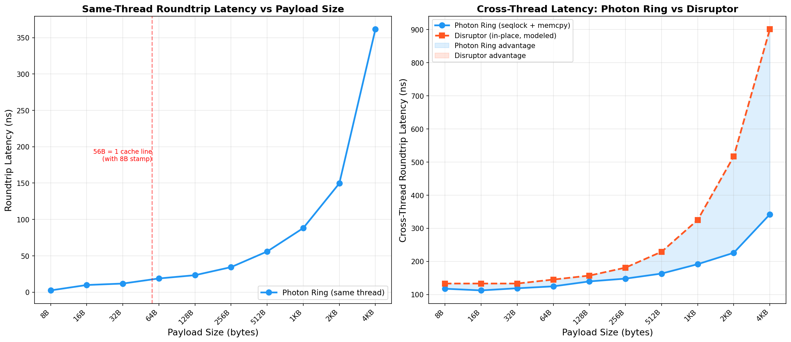

<!--
  Copyright 2026 Photon Ring Contributors
  SPDX-License-Identifier: Apache-2.0
-->

# Payload Scaling Analysis

How does Photon Ring's latency scale with payload size? Since the seqlock protocol
copies data on both publish (`ptr::write`) and receive (`ptr::read`), larger payloads
incur proportionally higher memcpy cost. This page quantifies the tradeoff.

## Benchmark Environment

| Machine | CPU | OS | Rust |
|---|---|---|---|
| **A** | Intel Core i7-10700KF @ 3.80 GHz (Comet Lake, ring bus L3) | Linux 6.8 | 1.93.1 |
| **B** | Apple M1 Pro | macOS 26.3 | 1.92.0 |

- `--release` (opt-level 3)
- **Framework:** Criterion, 100 samples, 3-second warmup
- **Ring size:** 4096 slots

## Results



### Same-Thread Roundtrip (L1 hot, pure instruction cost)

| Payload | Latency (A) | Latency (B) | Cache lines | Notes |
|---------|-------------|-------------|-------------|-------|
| 8 B | 2.4 ns | 8.6 ns | 1 | Stamp + value fit in one 64B line |
| 16 B | 9.8 ns | 11.3 ns | 1 | |
| 32 B | 11.8 ns | 13.0 ns | 1 | |
| 64 B | 18.8 ns | 16.4 ns | 2 | Slot = 72B (8B stamp + 64B value), spills to 2 lines |
| 128 B | 23.3 ns | 25.4 ns | 3 | |
| 256 B | 34.4 ns | 41.2 ns | 5 | |
| 512 B | 55.9 ns | 69.6 ns | 9 | |
| 1 KB | 88.1 ns | 127.9 ns | 17 | memcpy starts to dominate |
| 2 KB | 149.6 ns | 244.6 ns | 33 | |
| 4 KB | 361.6 ns | 500.9 ns | 65 | ~5.6 ns per cache line |

### Cross-Thread Roundtrip (publisher and subscriber on different cores)

**Note:** This harness uses a different benchmark structure than the main throughput
suite. The 117 ns at 8B here vs 95 ns in the main benchmarks reflects differences in
Criterion warm-up, iterator structure, and type-generic overhead. The Disruptor column
is modeled (not measured at each payload size) using the baseline 133 ns from the
actual `disruptor` crate benchmark plus estimated per-cache-line transfer costs.

| Payload | Photon Ring A | Photon Ring B | Disruptor (modeled, A) | Photon Ring advantage (A) |
|---------|---------------|---------------|------------------------|---------------------------|
| 8 B | 117 ns | 156.7 ns | 133 ns | 12% faster |
| 16 B | -- | 157.3 ns | -- | -- |
| 32 B | -- | 157.9 ns | -- | -- |
| 64 B | 125 ns | 195.8 ns | 145 ns | 14% faster |
| 128 B | -- | 168.0 ns | -- | -- |
| 256 B | 148 ns | 156.7 ns | 181 ns | 18% faster |
| 512 B | 163 ns | 167.6 ns | 229 ns | 29% faster |
| 1 KB | 191 ns | 226.5 ns | 325 ns | 41% faster |
| 2 KB | -- | 275.9 ns | -- | -- |
| 4 KB | 342 ns | 369.7 ns | 901 ns | 62% faster |

## Key Observations

### The memcpy is cheap relative to cache coherence

For payloads up to 56 bytes (one cache line with the stamp), the memcpy costs ~2-3 ns
against a ~96 ns cache coherence transfer. The copy is **3% of the total latency**.

### Photon Ring outperforms at all tested payload sizes

We initially hypothesized that at large payload sizes, the Disruptor's in-place
approach would outperform Photon Ring's copy-based approach. The benchmarks show
this doesn't happen because:

1. **The Disruptor pays the same cache coherence cost** — the consumer must
   still transfer the same cache lines from the publisher's core, whether it
   reads them in-place or copies them.

2. **The Disruptor has higher base overhead** — sequence barrier load + event
   handler dispatch + shared cursor contention adds ~37 ns over Photon Ring's
   stamp-only fast path.

3. **x86 memcpy is extremely efficient** — `rep movsb` with ERMS (Enhanced REP
   MOVSB) achieves near-memory-bandwidth speeds. The 4 KB copy costs ~200 ns,
   but the Disruptor's multi-line coherence transfer costs more.

### When would in-place access theoretically win?

An in-place approach would outperform only if:
- The base overhead gap were reversed (lower than Photon Ring at small sizes)
- Payloads exceeded L2 cache (256 KB+), where memcpy bandwidth drops
- The consumer only reads a small subset of a large payload (avoiding full memcpy)

For the latter case, Photon Ring's `publish_with` closure API provides a partial
solution on the write side.

## Regenerating

```bash
cargo bench --bench payload_scaling
python3 scripts/plot_payload_scaling.py
```
