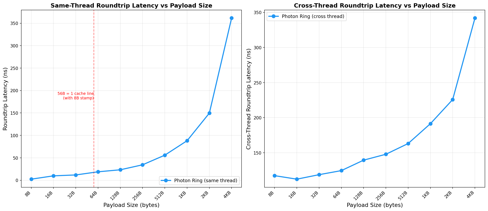

<!--
  Copyright 2026 Photon Ring Contributors
  SPDX-License-Identifier: MIT OR Apache-2.0
-->

# Payload Scaling Analysis

How does Photon Ring's latency scale with payload size? Since the seqlock protocol
copies data on both publish (`write_volatile`) and receive (`read_volatile`), larger payloads
incur proportionally higher memcpy cost. This page quantifies the tradeoff.

## Benchmark Environment

| Machine | CPU | OS | Rust |
|---|---|---|---|
| **A** | Intel Core i7-10700KF @ 3.80 GHz (Comet Lake, ring bus L3) | Linux 6.8 | 1.93.1 |
| **B** | Apple M1 Pro | macOS 26.3 | 1.92.0 |

- `--release` (opt-level 3)
- **Framework:** Criterion, 100 samples, 3-second warmup
- **Ring size:** 4096 slots

## Results



### Same-Thread Roundtrip (L1 hot, pure instruction cost)

| Payload | Latency (A) | Latency (B) | Cache lines | Notes |
|---------|-------------|-------------|-------------|-------|
| 8 B | 2.4 ns | 8.6 ns | 1 | Stamp + value fit in one 64B line |
| 16 B | 9.8 ns | 11.3 ns | 1 | |
| 32 B | 11.8 ns | 13.0 ns | 1 | |
| 64 B | 18.8 ns | 16.4 ns | 2 | Slot = 72B (8B stamp + 64B value), spills to 2 lines |
| 128 B | 23.3 ns | 25.4 ns | 3 | |
| 256 B | 34.4 ns | 41.2 ns | 5 | |
| 512 B | 55.9 ns | 69.6 ns | 9 | |
| 1 KB | 88.1 ns | 127.9 ns | 17 | memcpy starts to dominate |
| 2 KB | 149.6 ns | 244.6 ns | 33 | |
| 4 KB | 361.6 ns | 500.9 ns | 65 | ~5.6 ns per cache line |

### Cross-Thread Roundtrip (publisher and subscriber on different cores)

**Note:** This harness uses a different benchmark structure than the main throughput
suite. The 117 ns at 8B here vs 95 ns in the main benchmarks reflects differences in
Criterion warm-up, iterator structure, and type-generic overhead. Only Photon Ring is
measured here; the `--` cells are payload sizes not run on machine A.

| Payload | Photon Ring A | Photon Ring B |
|---------|---------------|---------------|
| 8 B | 117 ns | 156.7 ns |
| 16 B | -- | 157.3 ns |
| 32 B | -- | 157.9 ns |
| 64 B | 125 ns | 195.8 ns |
| 128 B | -- | 168.0 ns |
| 256 B | 148 ns | 156.7 ns |
| 512 B | 163 ns | 167.6 ns |
| 1 KB | 191 ns | 226.5 ns |
| 2 KB | -- | 275.9 ns |
| 4 KB | 342 ns | 369.7 ns |

## Key Observations

### The memcpy is cheap relative to cache coherence

For payloads up to 56 bytes (one cache line with the stamp), the memcpy costs ~2-3 ns
against a ~96 ns cache coherence transfer. The copy is **3% of the total latency**.

### Why copy-based delivery stays competitive at large payloads

A common expectation is that at large payloads an in-place design (write and read
the slot directly, no copy) should beat Photon Ring's copy-on-publish/copy-on-receive
approach. We have **not** benchmarked a competitor across these payload sizes, so this
is analysis rather than a measured result — but the copy is not the dominant cost:

1. **Cache coherence dominates, and any design pays it** — the consumer must
   transfer the modified cache lines from the publisher's core regardless of
   whether it reads them in-place or copies them out.

2. **x86 memcpy is extremely efficient** — `rep movsb` with ERMS (Enhanced REP
   MOVSB) reaches near-memory-bandwidth speeds; a 4 KB copy costs on the order of
   ~200 ns, small next to the multi-line coherence transfer it rides alongside.

3. **The stamp-only fast path has low fixed overhead** — no shared sequence
   barrier load or handler dispatch on the read side.

### When would in-place access theoretically win?

An in-place approach would outperform only if:
- The base overhead gap were reversed (lower than Photon Ring at small sizes)
- Payloads exceeded L2 cache (256 KB+), where memcpy bandwidth drops
- The consumer only reads a small subset of a large payload (avoiding full memcpy)

For the latter case, an event ring avoids the copy on both sides: slots own
their values and are mutated in place.

## Regenerating

```bash
cargo bench --bench payload_scaling
python3 scripts/plot_payload_scaling.py
```
